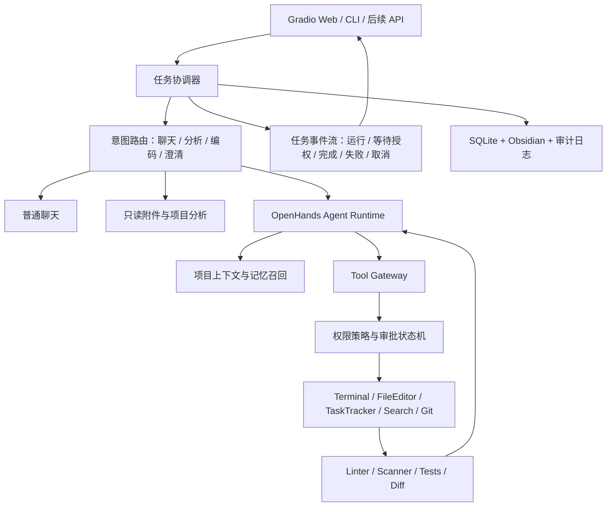
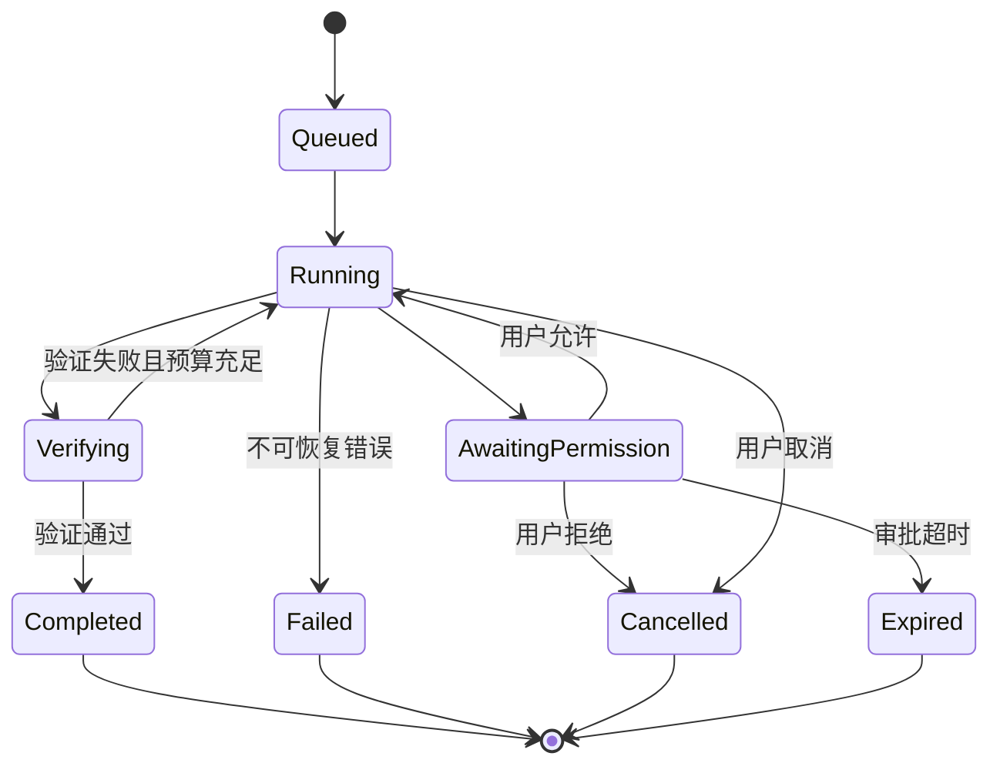
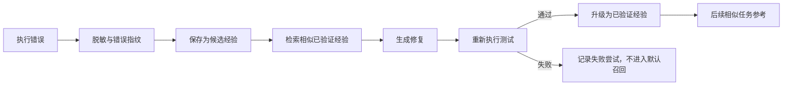

# AutoCodeAgent 渐进式优化路线图

> [!abstract] 核心结论
> AutoCodeAgent 已经不是“只有固定 Python 流水线”的原型：项目现已接入 OpenHands Agent、Conversation、TerminalTool、FileEditorTool 和 TaskTrackerTool，同时具备 Gradio Web、权限控制、附件解析、SQLite + Obsidian 记忆及错误经验库。
>
> 下一阶段不应重新实现一套 Agent Loop，而应围绕现有 OpenHands 主引擎完成：**稳定执行、可靠授权、工具边界、验证闭环、任务恢复和安全隔离**。

## 1. 文档目的

本文件定义 AutoCodeAgent 从当前可运行原型演进为可靠本地编程 Agent 的产品边界、架构决策、实施顺序和验收标准。

目标用户首先是项目作者本人，主要运行环境为 Windows 本地电脑，核心使用场景包括：

- 普通聊天，不误触发代码生成。
- 读取、理解和修改现有项目。
- 创建新项目或单文件程序。
- 在需要安装依赖、访问网络、修改文件或调用硬件时明确询问用户。
- 上传图片、PDF、Word、Excel 和文本文件后进行分析。
- 自动运行测试、读取错误、修复代码并再次验证。
- 将会话、日志和经过验证的错误经验写入 SQLite，并同步到 Obsidian。

### 1.1 产品目标

> 在用户授权范围内，Agent 能读取代码库、制定计划、调用工具、修改代码、执行验证、从已验证经验中检索解决方案，并交付可检查、可回滚的结果。

### 1.2 非目标

当前阶段明确不追求：

- 完全无人监督地操作整台电脑。
- 无限轮次、无限 Token 或无限时间运行。
- 同时维护多套独立 Agent Loop。
- 在核心单 Agent 不稳定时提前建设复杂多 Agent 团队。
- 未经验证就把失败输出写成“成功经验”。
- 用 Git Worktree 代替真正的进程或容器安全隔离。
- 一开始就支持所有编程语言、IDE 和外部平台。

---

## 2. 当前实现快照

> [!info] 快照日期
> 以下判断基于 2026-07-17 的本地代码。后续每次架构调整都应更新本节，避免路线图与代码再次脱节。

### 2.1 已具备能力

| 能力 | 当前实现 | 状态 |
|---|---|---|
| Web 界面 | Gradio 流式界面、任务输出、权限按钮 | 已有 |
| 意图路由 | 区分聊天、编码和澄清请求 | 已有 |
| Agent 运行时 | OpenHands Agent + Conversation | 已有 |
| 终端工具 | OpenHands TerminalTool | 已有 |
| 文件工具 | OpenHands FileEditorTool | 已有 |
| 任务跟踪 | OpenHands TaskTrackerTool | 已有 |
| 传统流水线 | Planner/Coder/Executor/Fixer 兼容路径 | 已有 |
| 权限等级 | 受限、询问、信任三种模式 | 已有 |
| 附件上传 | 图片、文本、PDF、DOCX、XLSX 等 | 已有 |
| 长期记忆 | SQLite 会话、记忆、错误经验 | 已有 |
| Obsidian 同步 | 会话和日志导出为 Markdown | 已有 |
| 质量检查 | Linter、安全扫描、执行超时 | 已有 |

### 2.2 部分完成、需要稳定的能力

| 能力 | 当前问题 | 优先方向 |
|---|---|---|
| Agentic Loop | 已接入，但与旧流水线并存 | 明确主引擎和回退边界 |
| 权限确认 | 授权状态可能过期、丢失或无法恢复原任务 | 建立持久任务 ID 和审批状态机 |
| 依赖安装 | 能识别风险，但询问、恢复和结果展示不稳定 | 权限卡片显示完整操作并原地恢复 |
| 附件分析 | 已支持，但只读请求曾误进入工具权限流程 | 只读分析与工具执行彻底分离 |
| 图片理解 | 已有多模态链路，但需按模型能力可靠降级 | 启动时能力探测与清晰错误提示 |
| 文档读取 | 已支持常见格式，需完善编码、大小和格式异常 | 建立解析器测试矩阵 |
| 错误经验 | 已有存储与召回，但验证条件需要更严格 | 只召回经过测试确认的经验 |
| 执行隔离 | 有独立子进程和超时，不等于 OS 级沙箱 | 后续增加容器或低权限 Runner |
| 任务流 | Web 长任务仍可能阻塞或因刷新丢状态 | 后台任务、取消、恢复和事件流 |

### 2.3 尚未形成完整能力

- 一等公民的 Glob/Grep/代码索引工具。
- WebSearch/WebFetch 及网络域名策略。
- Git Diff 预览、快照、自动回滚和 Worktree 隔离。
- OS 级或容器级安全沙箱。
- MCP 客户端生态、Hooks 和插件系统。
- 子 Agent、Agent 团队和并行任务编排。
- IDE 插件和远程执行节点。
- 系统化多语言工具链探测。

> [!warning] 配置注意
> `AGENT_ENGINE` 当前默认值仍可能指向 `legacy`。发布前必须明确默认主引擎、回退条件和 UI 中显示的实际运行引擎，不能让用户以为正在使用 OpenHands，实际却进入旧流水线。

---

## 3. 架构决策

### ADR-001：OpenHands 作为主 Agent 运行时

**状态：接受**

决定：

- OpenHands SDK 负责 Agent、Conversation、工具调用和确认策略。
- AutoCodeAgent 负责 UI、任务协调、权限体验、附件、记忆、安全策略、质量验证和产品化能力。
- 传统 Planner/Coder/Executor/Fixer 暂时保留为兼容回退，但不继续扩展。
- 不再从零实现另一套 Read/Write/Edit/Bash Agent Loop。

理由：

- 当前项目已完成 OpenHands 基础接入。
- 重新实现工具协议、会话恢复和确认机制会重复造轮子。
- 当前真正的问题是集成稳定性，而不是缺少第三套 Agent 框架。

代价：

- 需要跟踪 OpenHands SDK API 变化。
- 必须为 SDK 与产品层建立清晰适配接口。
- 测试中需要隔离真实模型和真实工具执行。

### ADR-002：安全、权限和恢复能力前置

**状态：接受**

决定：

- 每次工具调用先经过统一 Tool Gateway。
- 权限不只是 UI 选项，而是后端强制执行策略。
- 审批必须绑定任务、会话、具体动作和参数指纹。
- Bash、网络、依赖安装、项目外写入、删除、硬件访问必须分类管理。

理由：

- 新增工具会扩大风险面。
- “询问模式卡住”本质是任务状态和审批状态没有可靠衔接。
- 只有先解决恢复机制，才能安全扩大自主范围。

### ADR-003：记忆是“检索经验”，不是自动训练

**状态：接受**

决定：

- 失败记录首先标记为候选经验。
- 只有修复后验证通过，才能升级为已验证经验。
- Agent 下次遇到类似错误时可以参考，但仍必须在当前环境重新验证。

理由：

- 盲目学习失败修复会污染记忆库。
- 同一个报错在不同项目、系统、语言版本和依赖版本下可能有不同原因。

---

## 4. 目标架构



### 4.1 模块职责边界

| 层 | 负责 | 不负责 |
|---|---|---|
| UI | 输入、附件、状态展示、审批、取消、Diff | 决定后端是否真的有权限 |
| 任务协调器 | 任务 ID、状态机、事件流、恢复 | 具体模型推理 |
| Agent Runtime | 推理、计划、工具选择、观察结果 | 绕过权限直接执行 |
| Tool Gateway | 工具注册、参数校验、权限、超时、审计 | 自主决定产品需求 |
| 质量层 | 测试、扫描、格式、Diff、验收证据 | 修改用户需求 |
| 记忆层 | 会话、偏好、已验证经验、Obsidian 同步 | 把所有日志无条件加入提示词 |

---

## 5. 设计原则

1. **一个主运行时**  
   OpenHands 为主，旧流水线只做有限回退，禁止继续形成两套平行功能。

2. **受约束的自主性**  
   自主程度必须受权限、工作区、轮次、时间、Token、费用和网络策略限制。

3. **证据驱动完成**  
   “代码已生成”不等于“任务完成”。完成必须给出测试、静态检查、运行结果或无法验证的原因。

4. **最小修改原则**  
   优先修改最少文件，交付清晰 Diff，并支持回滚。

5. **只读与写操作分离**  
   图片分析、文档读取、代码解释等只读请求不应触发安装依赖或写文件权限。

6. **权限在后端生效**  
   前端按钮只是授权入口，最终执行必须由后端验证审批记录。

7. **记忆必须可验证、可撤销**  
   错误经验需要状态、来源、适用范围、验证证据和失效机制。

8. **先测核心，再扩生态**  
   单 Agent 未稳定前，不优先建设多 Agent、IDE 插件、定时任务或大规模 RAG。

---

## 6. MVP 定义与成功指标

### 6.1 MVP 任务

用户选择一个现有项目并描述一个中小型需求，Agent 应当：

1. 判断是聊天、只读分析还是编码任务。
2. 读取相关项目规则和文件。
3. 给出简短计划。
4. 在需要时展示具体权限请求。
5. 用户允许后从原任务原位置继续，不要求重新提交。
6. 进行最小代码修改。
7. 运行相关检查或测试。
8. 失败时读取错误并在预算内尝试修复。
9. 展示改动文件、Diff、验证结果和剩余风险。
10. 把会话和经过验证的经验保存到 SQLite/Obsidian。

### 6.2 基准任务集

建立至少 20 个可重复任务，覆盖：

- 4 个普通聊天或澄清任务。
- 4 个附件分析任务，包括图片、PDF、DOCX、XLSX。
- 4 个现有代码库小修改任务。
- 3 个依赖缺失并需要询问安装的任务。
- 2 个执行失败后自动修复的任务。
- 2 个危险操作必须拒绝或二次确认的任务。
- 1 个页面刷新后继续等待授权的任务。

### 6.3 第一阶段目标指标

| 指标 | 目标 |
|---|---:|
| 基准任务成功率 | ≥ 80% |
| 普通聊天误进入编码流程 | 0 次 |
| 只读附件分析误触发工具权限 | 0 次 |
| 项目外未授权写入 | 0 次 |
| 过期审批被错误复用 | 0 次 |
| 无限循环或无预算运行 | 0 次 |
| 所有代码修改均可查看 Diff | 100% |
| 声称完成但未给验证证据 | 0 次 |

> [!important] 指标解释
> 成功率不能只统计“页面有输出”。必须检查需求是否完成、代码是否可运行、权限是否正确、结果是否可复现。

---

## 7. 权限与任务状态设计

### 7.1 权限等级

| 等级 | 行为 |
|---|---|
| 受限模式 | 只允许聊天、只读分析和明确安全的项目内读取；写入、安装、网络及敏感工具拒绝 |
| 询问模式 | 每个新的风险动作显示审批卡片；批准后原任务继续执行 |
| 信任模式 | 仅对白名单内、工作区内的低中风险操作自动批准；高风险动作仍询问 |

信任模式也不应自动允许：

- 删除项目外文件。
- 修改系统目录或注册表。
- 读取密钥、浏览器凭据等敏感数据。
- 上传本地数据到未知网络地址。
- 执行格式化磁盘、关机等系统级命令。
- 未声明目标的摄像头、麦克风或其他硬件访问。

### 7.2 审批记录

每次权限请求至少保存：

```text
approval_id
task_id
conversation_id
action_id
tool_name
normalized_arguments
argument_fingerprint
risk_level
reason
status
created_at
expires_at
resolved_at
```

批准只能用于同一个 `task_id + action_id + 参数指纹`，不得批准后替换命令或安装其他包。

### 7.3 任务状态机



### 7.4 权限卡片必须显示

- Agent 想做什么。
- 使用哪个工具。
- 完整目标路径、包名、命令或网络域名。
- 为什么需要。
- 风险等级和影响范围。
- 是否只允许本次。
- 允许、拒绝、取消任务三个明确动作。

依赖安装示例：

> [!question] 需要安装依赖
> 包：`PyQt5`  
> 环境：项目虚拟环境 `.venv`  
> 命令：`python -m pip install PyQt5`  
> 原因：运行用户要求的 PyQt 登录界面。  
> 影响：需要访问网络并修改虚拟环境。  
> 批准范围：仅本次任务、仅此包和此命令。

---

## 8. 错误经验学习闭环



### 8.1 经验记录字段

- 错误类型和归一化指纹。
- 项目类型、语言和运行环境。
- Python/Node 等运行时版本。
- 相关依赖及版本。
- 原始错误摘要，保存前必须脱敏。
- 尝试过的修复。
- 最终有效修复。
- 验证命令和结果。
- 成功次数、失败次数和最后使用时间。
- 状态：`candidate`、`verified`、`deprecated`、`rejected`。

### 8.2 召回规则

- 默认只召回 `verified`。
- 优先匹配同项目、同语言、同依赖和同错误指纹。
- 经验只能作为建议，当前任务必须重新验证。
- 连续失败的经验降低权重或标记为 `deprecated`。
- 不把密钥、绝对私人路径和完整用户文件内容写入经验。

---

## 9. 渐进式实施路线

### 阶段 0：基线和配置收口

**目标：知道现在到底能做什么，并保证每次优化可以量化比较。**

- [ ] 建立 20 个基准任务及预期结果。
- [ ] 记录当前成功率、平均轮次、耗时和权限失败率。
- [ ] 明确 `AGENT_ENGINE` 默认值、UI 展示和回退条件。
- [ ] 给 OpenHands、Legacy、附件、权限和记忆链路增加统一任务 ID。
- [ ] 记录运行时版本和关键依赖版本。

完成标准：

- 基准任务可以一键或按文档重复执行。
- 每个失败都能定位到任务、会话、引擎和阶段。
- UI 显示的引擎与后端实际运行引擎一致。

### 阶段 1：稳定 OpenHands 执行与权限恢复

**目标：询问模式不再卡死，批准后能够继续同一个任务。**

- [ ] 统一 Conversation、Task、Action、Approval 的 ID 映射。
- [ ] 把待审批状态持久化，页面刷新后仍能恢复。
- [ ] 用户批准后恢复原 Conversation，而不是重新创建请求。
- [ ] 新上传附件或新需求自动使旧审批失效。
- [ ] 加入取消、超时、最大轮次、最大无进展次数。
- [ ] 依赖安装显示包、命令、环境、原因和风险。
- [ ] 信任模式也执行后端白名单和路径边界。
- [ ] 将工具调用和结果作为结构化事件流输出。

完成标准：

- 询问模式下安装 PyQt 等依赖能完成“询问 → 允许 → 安装 → 继续运行”。
- 重复点击允许不会重复执行同一动作。
- 拒绝、超时和刷新页面不会错误执行。
- 任务可以由用户取消，并在合理时间内停止。

### 阶段 2：一等代码库工具与上下文

**目标：提高修改现有项目的准确率，不重新实现已有编辑器和终端。**

- [ ] 给 TerminalTool/FileEditorTool 增加 AutoCodeAgent Tool Gateway。
- [ ] 增加结构化 Glob、Grep 或等价搜索接口。
- [ ] 自动读取 `AGENTS.md`、项目 README 和本地规则文件。
- [ ] 构建有限深度文件树和项目摘要。
- [ ] 对工具输出进行分页、截断和引用定位。
- [ ] 修改前读取目标文件，修改后生成 Diff。
- [ ] 支持编码检测、二进制识别和符号链接边界检查。
- [ ] 仅在必要时才扩展到 RAG 或向量索引。

完成标准：

- Agent 能在中型项目中找到相关文件并进行最小修改。
- 搜索输出过大时不会挤爆上下文。
- 所有修改均可追溯到文件和 Diff。

### 阶段 3：验证、Git 与安全隔离

**目标：让“完成”可验证，让失败可回滚。**

- [ ] 自动识别相关测试、Linter、Formatter 和类型检查。
- [ ] 修改后至少运行一个有效验证步骤。
- [ ] 增加 Git 状态、Diff 和快照。
- [ ] 可选使用独立 Worktree 执行任务。
- [ ] 增加工作区外路径、符号链接和目录穿越防护。
- [ ] 对终端输出和日志执行密钥脱敏。
- [ ] 设计低权限 Runner 或 Docker 沙箱实验。
- [ ] 为网络访问增加域名、方法和下载大小策略。

完成标准：

- 失败任务可以恢复到修改前状态。
- Agent 无法在未授权情况下写出工作区。
- Worktree 被明确标注为版本隔离，不冒充安全沙箱。
- 高风险命令在所有权限模式下都受到强制策略约束。

### 阶段 4：长期任务、上下文和经验质量

**目标：支持更长任务，同时避免记忆污染和上下文失控。**

- [ ] 上下文按规则压缩，保留需求、决策、Diff 和未解决问题。
- [ ] 任务可暂停、重启和恢复。
- [ ] 错误经验增加候选、验证、废弃状态。
- [ ] 召回考虑项目、语言、版本和错误指纹。
- [ ] 在 Obsidian 中生成可读的任务总结和经验卡片。
- [ ] 增加记忆命中率、采用率和修复成功率统计。

完成标准：

- 重启 Web 服务后仍能查看任务状态和关键历史。
- 未验证经验不会自动注入 Agent 上下文。
- Obsidian 日志不包含密钥和不必要的完整隐私数据。

### 阶段 5：高级生态

只有阶段 1—4 达标后再按真实需求实施：

- [ ] 子 Agent 和并行任务。
- [ ] MCP 客户端能力。
- [ ] Hooks 和插件系统。
- [ ] 后台计划任务与持久调度。
- [ ] IDE 集成。
- [ ] JavaScript/TypeScript、Go、Rust、Java、C/C++ 工具链。
- [ ] 远程 Runner 或云端任务。

进入条件：

- 单 Agent 基准成功率稳定。
- 权限、取消、恢复、验证和回滚已通过测试。
- 新功能有清晰用户场景，不是单纯为了模仿其他产品。

---

## 10. 测试策略

### 10.1 单元测试

- 意图路由不会把“你好”识别为代码任务。
- 权限策略正确区分只读、写入、安装、网络和高风险命令。
- 审批参数指纹变化后旧批准失效。
- 路径规范化、符号链接和目录穿越检查。
- 附件类型、大小、扩展名与实际内容校验。
- 错误经验只有验证通过后才能成为 `verified`。
- Token、输出长度、轮次和时间预算。

### 10.2 集成测试

- OpenHands Conversation 创建、恢复和关闭。
- 询问模式批准后恢复同一 Action。
- 拒绝、超时和页面刷新。
- PyQt5 等依赖安装的询问与继续。
- 图片、PDF、DOCX 和 XLSX 只读分析。
- Terminal/FileEditor 调用经过 Tool Gateway。
- SQLite 和 Obsidian 同步及敏感信息脱敏。

### 10.3 端到端测试

| 场景 | 预期 |
|---|---|
| 输入“你好” | 直接聊天，不创建代码任务 |
| 上传图片并询问内容 | 直接分析，不请求写文件权限 |
| 上传文档并要求总结 | 读取并总结，不进入安装流程 |
| 要求制作 PyQt 登录界面 | 识别依赖，缺失时询问安装 |
| 允许安装 PyQt5 | 原任务继续，最终运行或给出可复现错误 |
| 拒绝安装依赖 | 任务停止或提供无需安装的替代方案 |
| 修改现有项目 | 展示计划、文件变更、Diff 和验证结果 |
| 命令尝试写到项目外 | 拒绝或明确二次授权 |
| 页面刷新后批准 | 恢复正确任务，不显示“没有待确认权限” |
| 重复错误 | 召回已验证经验并在当前环境重新测试 |

### 10.4 建议质量门槛

每次合并前至少执行：

```powershell
python -m pytest -q
```

涉及 Web UI、权限恢复或附件时，还必须执行对应端到端手动检查或浏览器自动化测试。

---

## 11. 可观测性与审计

每个任务应记录结构化事件：

```text
task_created
route_decided
context_loaded
agent_started
tool_requested
permission_requested
permission_resolved
tool_started
tool_completed
verification_started
verification_completed
memory_candidate_created
memory_verified
task_completed
task_failed
task_cancelled
```

每条事件至少包含：

- `task_id`
- `conversation_id`
- 时间戳
- 当前状态
- 引擎名称和版本
- 工具名称
- 脱敏后的参数摘要
- 耗时
- 结果状态
- 错误类型

日志禁止保存：

- API Key、访问令牌和密码。
- 未经脱敏的环境变量。
- 与任务无关的用户私人文件内容。
- 不必要的完整命令输出。

---

## 12. 风险与回滚

| 风险 | 表现 | 缓解 |
|---|---|---|
| 双引擎长期并存 | 相同需求走不同逻辑，难以复现 | 明确 OpenHands 主路径和 Legacy 退出时间 |
| 审批状态过期 | 用户允许后提示无待确认权限 | 持久 Action/Approval ID，状态机恢复 |
| 工具输出过大 | 上下文溢出、模型忽略关键错误 | 截断、分页、摘要和原始日志引用 |
| 记忆污染 | 下次重复采用错误修复 | 候选/验证/废弃状态和当前环境复验 |
| SDK 版本漂移 | OpenHands API 更新导致适配失效 | 固定版本、适配层和契约测试 |
| 工作区逃逸 | 路径穿越、符号链接写出项目 | 规范化路径、真实路径检查和后端阻断 |
| 子进程不等于沙箱 | 恶意或错误代码影响本机 | 低权限 Runner、容器和网络限制 |
| 自动安装供应链风险 | 安装恶意包或错误包 | 精确包名、来源、版本、用户确认和白名单 |
| UI 阻塞 | 长任务卡住、刷新后丢失 | 后台任务、事件流、持久状态和取消 |

回滚原则：

- 配置切换必须可恢复到上一个稳定引擎。
- 数据库变更必须有版本和迁移脚本。
- 代码修改通过 Git 快照或 Worktree 回滚。
- 新工具默认关闭，通过功能开关逐步启用。
- 先在基准任务集验证，再扩大默认启用范围。

---

## 13. 优先级总表

| 优先级 | 工作项 | 原因 |
|---|---|---|
| P0 | 权限批准后原任务可靠恢复 | 当前核心阻断问题 |
| P0 | 任务 ID、Action ID、审批状态持久化 | 解决卡死、过期和误批准 |
| P0 | OpenHands 主引擎与 Legacy 边界 | 防止重复架构继续扩散 |
| P0 | 取消、超时、轮次和无进展限制 | 防止失控运行 |
| P0 | 基准任务与可观测日志 | 后续优化必须可测量 |
| P1 | Tool Gateway、路径和命令策略 | 安全扩大工具能力 |
| P1 | Git Diff、验证和回滚 | 提高结果可信度 |
| P1 | 只读附件链路稳定化 | 修复图片/文档权限误触发 |
| P1 | 已验证错误经验闭环 | 提高重复问题修复率 |
| P2 | Worktree 和容器 Runner | 加强隔离 |
| P2 | 结构化搜索和上下文压缩 | 支持更大项目 |
| P3 | MCP、Hooks、子 Agent、IDE、多语言 | 核心稳定后扩展 |

---

## 14. 项目级完成定义

只有同时满足以下条件，才能称为“可用的自主编程 Agent”：

- [ ] 普通聊天不会误写代码。
- [ ] 只读分析不会误请求写入或安装权限。
- [ ] 询问模式可以批准、拒绝、超时和恢复。
- [ ] Agent 不能绕过后端权限策略。
- [ ] 修改前理解项目规则，修改后展示 Diff。
- [ ] 每次声称完成都有验证证据或明确说明无法验证。
- [ ] 失败可以取消、回滚和定位。
- [ ] 任务重启或页面刷新后状态不会错乱。
- [ ] 错误经验只有验证通过后才参与默认召回。
- [ ] SQLite、Obsidian 和日志不泄露密钥。
- [ ] 基准任务成功率达到目标。
- [ ] 核心能力有自动化测试保护。

---

## 15. 后续文档

建议在真正实施相应架构变化时新增：

- `docs/decisions/ADR-001-openhands-primary-runtime.md`
- `docs/decisions/ADR-002-permission-state-machine.md`
- `docs/decisions/ADR-003-verified-error-memory.md`
- `docs/architecture/task-events.md`
- `docs/security/tool-permission-policy.md`
- `docs/testing/agent-benchmark.md`

相关官方参考：

- [OpenHands SDK 文档](https://docs.openhands.dev/sdk)
- [Claude Code 功能概览](https://code.claude.com/docs/en/features-overview)
- [Claude Code 工具参考](https://code.claude.com/docs/en/tools-reference)
- [Claude Code 权限机制](https://code.claude.com/docs/en/permissions)
- [LangGraph v1 迁移指南](https://docs.langchain.com/oss/python/migrate/langgraph-v1)

> [!success] 最终方向
> AutoCodeAgent 的竞争力不在于复制所有 Claude Code 功能，而在于把本地可控权限、OpenHands 工具执行、SQLite + Obsidian 长期记忆、附件理解和可验证修复组合成一条稳定、透明、可恢复的编程工作流。
